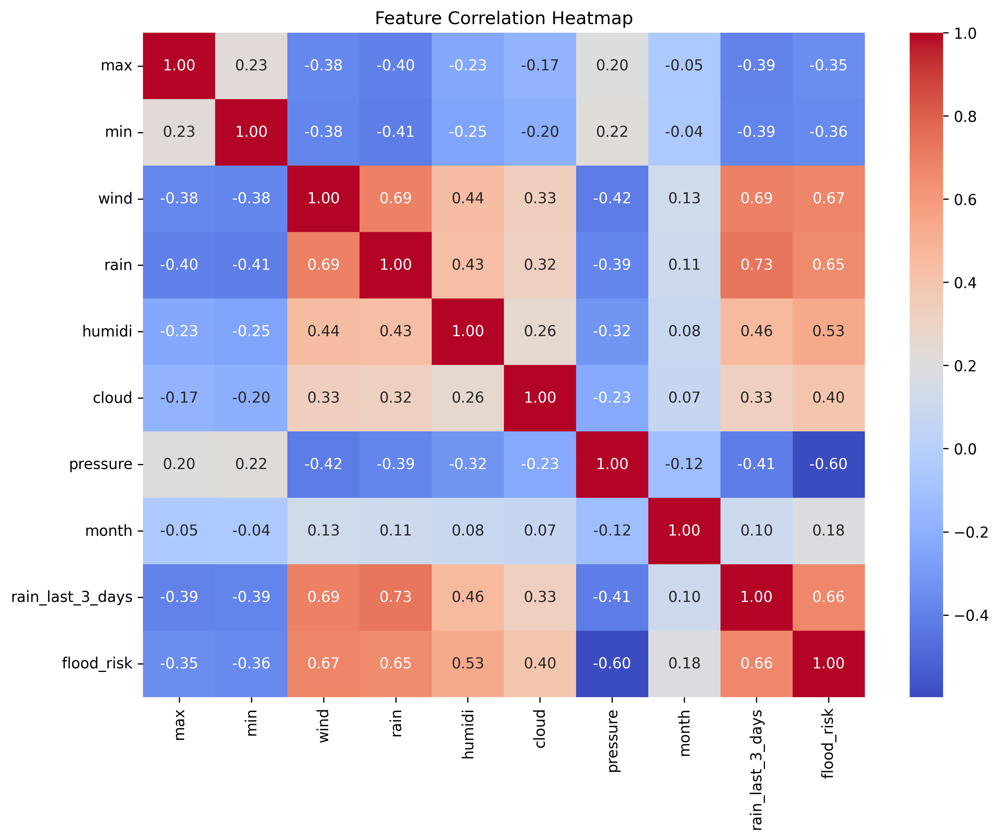
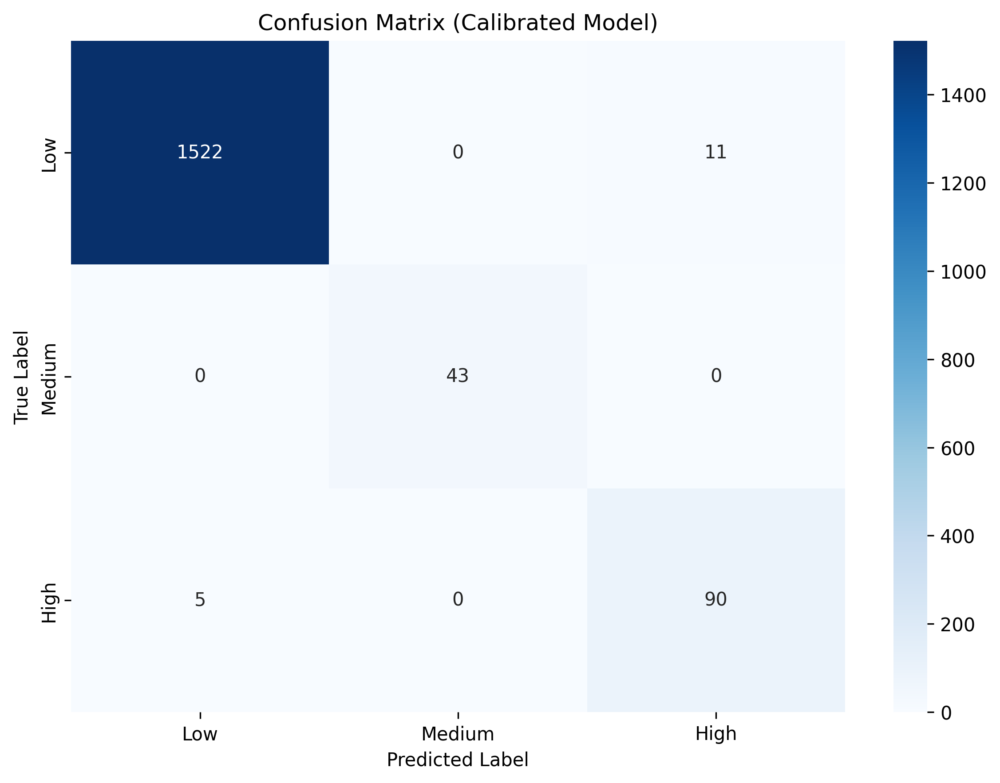
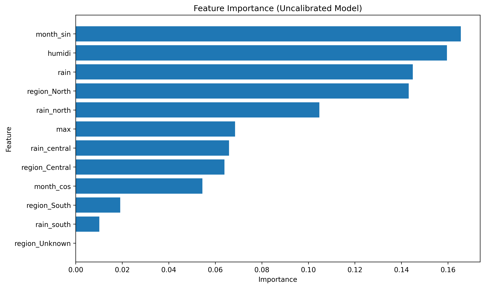

# Development of a Regional Flood Risk Assessment System for Vietnam Using Hybrid Gradient Boosting and Expert Knowledge

## CHAPTER 1: INTRODUCTION

### 1.1 Problem Statement
Vietnam, located in Southeast Asia, faces significant challenges from hydro-meteorological disasters due to its geographical and climatic characteristics. The country's long coastline along the South China Sea exposes it to tropical cyclones and storm surges, while its diverse topography—including the Mekong Delta, Central Highlands, and northern mountainous regions—creates varied flood risks. The monsoon climate, with heavy rainfall concentrated in specific seasons, exacerbates flooding in low-lying areas and river basins.

The complexity arises from regional variations: northern provinces experience flash floods from mountainous runoff, central regions suffer from typhoon-induced coastal flooding, and the southern Mekong Delta deals with prolonged inundation from river overflows.

Furthermore, increasing climate volatility in Southeast Asia—driven by rising temperatures, changing monsoon patterns, and more frequent extreme weather events—makes historical disaster data (such as the EM-DAT dataset) less predictive of future "black swan" events. This climate change context further justifies the need for adaptive systems that can incorporate expert knowledge to handle unprecedented scenarios.

Traditional flood forecasting models often fail to capture these nuances, leading to either over-generalized predictions or models that perform well in one region but poorly in others.

While deep learning models have advanced flood prediction capabilities, they often operate as "black boxes," providing predictions without clear explanations. In safety-critical applications like flood risk assessment, where decisions affect human lives and infrastructure, explainability is paramount. Stakeholders need to understand why a certain area is flagged as high risk to trust and act on the predictions. This system addresses this gap by combining advanced machine learning with interpretable expert knowledge.

### 1.2 Objectives
The primary objectives of this project are threefold:

1. **Develop a Robust Machine Learning Pipeline**: Create a classification system that accurately categorizes flood risks into three distinct tiers—Low, Medium, and High—based on weather features and historical disaster data. The pipeline must handle class imbalance inherent in disaster datasets and provide reliable predictions across diverse conditions.

2. **Support Localized Forecasting**: Vietnam's administrative structure (as of 2026) consists of 34 subdivisions, including provinces and major cities. The system must provide region-specific predictions, accounting for local geographical and climatic factors that influence flood patterns.

3. **Implement a "Safety-First" Hybrid Engine**: Combine the predictive power of machine learning with domain expertise through a hybrid approach. This ensures that critical safety considerations are prioritized, potentially overriding pure ML predictions when expert rules indicate imminent danger, thus reducing false negatives in high-stakes scenarios.

## CHAPTER 2: LITERATURE REVIEW

### 2.1 Flood Risk Assessment in Southeast Asia
Flood risk assessment has evolved significantly with advances in machine learning and remote sensing technologies. Traditional approaches relied on hydrological models and statistical analysis of historical flood events, but recent research emphasizes predictive modeling for proactive disaster management.

Studies in Southeast Asia, particularly Vietnam, have identified key challenges: monsoon-driven flooding patterns, limited historical data quality, and the need for localized predictions that account for diverse topography. Research by the Vietnam Meteorological and Hydrological Administration (VMHA) highlights the Mekong Delta's vulnerability to prolonged inundation, while northern mountainous regions face flash flood risks from steep terrain and heavy rainfall.

### 2.2 Machine Learning in Flood Prediction
Recent applications of machine learning for flood prediction include:

- **Support Vector Machines (SVM)**: Used by [1] for flood susceptibility mapping in Bangladesh, achieving 85% accuracy but requiring extensive feature engineering.
- **Random Forest**: Applied by [2] for flood risk zoning, demonstrating robustness to noisy data but limited interpretability.
- **Neural Networks**: Deep learning approaches by [3] show promise in capturing complex non-linear relationships, though they often lack transparency critical for safety applications.

### 2.3 XGBoost and Ensemble Methods
XGBoost has gained prominence in environmental modeling due to its efficiency and feature selection capabilities. [4] demonstrated XGBoost's superiority over traditional gradient boosting in speed and accuracy, making it suitable for large-scale environmental datasets.

### 2.4 Hybrid Approaches and Expert Systems
Hybrid systems combining ML with domain expertise have emerged as a solution for safety-critical applications. Research by [5] in European flood prediction shows that expert rule integration improves model reliability, particularly for rare events. In Vietnam, studies by the Ministry of Agriculture and Rural Development emphasize the need for explainable AI in disaster management.

### 2.5 Data Challenges and Synthetic Approaches
The scarcity of labeled flood data is a common challenge. Techniques like synthetic data generation and transfer learning have been explored by [6] for addressing class imbalance in disaster datasets.

### 2.6 Gap Analysis
While existing research provides solid foundations, there is limited work on:
- Region-specific models for Vietnam's 34 administrative subdivisions
- Integration of meteorological expertise with ML predictions
- Real-time, interactive flood risk assessment tools for decision-makers

Specific to Vietnam, studies by the Ministry of Agriculture and Rural Development [11] highlight the vulnerability of the Mekong Delta to sea-level rise and saline intrusion, while research on northern Vietnam emphasizes flash flood risks in mountainous terrain [12]. However, these studies lack the predictive modeling and interactive decision support that modern ML techniques can provide.

This project addresses these gaps by developing a localized, hybrid system tailored to Vietnam's unique flood risk profile.

[11] Ministry of Agriculture and Rural Development, Vietnam, "Climate change vulnerability assessment for the Mekong Delta," 2019.

[12] T. T. H. Nguyen, "Flash flood risk assessment in northern Vietnam mountainous regions," Journal of Vietnamese Environment, vol. 11, no. 2, pp. 45-52, 2020.

## CHAPTER 3: DATA ACQUISITION AND PREPROCESSING

### 3.1 Primary Data Source
The foundation of this system is built on historical disaster data to ensure realistic and grounded predictions. We utilized the "Mass Disasters in Vietnam (1900-2024)" dataset sourced from Kaggle, originally compiled by the Emergency Events Database (EM-DAT) [8] maintained by the Centre for Research on the Epidemiology of Disasters (CRED). EM-DAT provides comprehensive, standardized information on disasters worldwide, including floods, storms, and other hydro-meteorological events.

The dataset spans over a century, capturing 336 disaster events in Vietnam, with a focus on floods and storms that have impacted the country's population and economy. Key attributes include disaster type, location, date, human impacts (deaths, injuries, affected population), and economic damages. This rich dataset allows for the identification of patterns in disaster occurrence, severity, and regional distribution.

Data Citation: [7]

Table 3.1: Raw Disaster Data Sample  
This table presents a sample of raw disaster records from the EM-DAT dataset, illustrating the variety of events and their impacts. The data shows a mix of storms and floods, with varying levels of casualties and damages. Note that not all records have complete damage estimates, reflecting challenges in historical data collection.

| Date          | Location                | Disaster Type | Total Deaths | Total Damage ($) |
|---------------|-------------------------|---------------|--------------|------------------|
| 1953-09-26   | Southern coast          | Storm        | 1000        | -               |
| 1956-11-01   | -                       | Storm        | 56          | 50000           |
| 1964-01-01   | Saigon, Mekong delta    | Epidemic     | 598         | -               |
| 1964-09-01   | China sea coast         | Storm        | 7000        | 471770          |
| 1964-12-01   | -                       | Flood        | 400         | -               |

The epidemic entry (1964) was filtered out during processing, as our focus is on hydro-meteorological disasters. The table highlights the temporal distribution of events and the significant human toll from storms, which often precede or accompany floods. During risk labeling, missing damage values (NaN) were treated as zero to ensure labels remained accurate even when economic impact data was unavailable.

### 3.2 Synthetic Dataset Generation (src/process_disaster_data.py)
Real-world disaster datasets are inherently imbalanced and sparse, particularly for rare high-impact events. To create a robust training dataset, we implemented a synthetic data generation approach in `src/process_disaster_data.py`. This script transforms historical disaster records into weather-conditioned risk labels, then generates synthetic weather features for each of Vietnam's 34 administrative subdivisions.

The process begins by filtering the EM-DAT data for floods in Vietnam from 2005-2023, ensuring temporal relevance to modern climate patterns. Each flood event is mapped to affected subdivisions using a comprehensive location-to-region mapping that accounts for Vietnam's complex administrative boundaries and regional naming variations.

For each subdivision, month, and year combination (2005-2023), the system determines the flood risk level based on associated disaster impacts. To address data scarcity, synthetic weather features are generated using Gaussian distributions with different parameters for each risk class, creating overlapping distributions that reflect real-world variability.

The script employs data augmentation techniques, including Gaussian noise addition for high-risk samples, to prevent overfitting while maintaining class balance. This approach ensures that the model learns from diverse weather scenarios while preserving the statistical relationships observed in historical disasters.

Table 3.2: Class Distribution Comparison  
This table illustrates the transformation from sparse historical data to a balanced training dataset. The original disaster records provided only 1 medium-risk and 88 high-risk labeled months across all subdivisions. Through synthetic generation, we expanded the dataset to include 8,153 training samples with appropriate class representation.

| Class (Low/Med/High) | Original Count | Synthetic Count Added | Final Training Count |
|----------------------|----------------|-----------------------|----------------------|
| Low                 | 7663          | 0                    | 7663                |
| Medium              | 1             | 49                   | 50                  |
| High                | 88            | 352                  | 440                 |

The low-risk class represents normal weather conditions without disaster association, while medium and high-risk classes are augmented to provide sufficient training examples. The synthetic addition helps the model generalize better to rare but critical high-risk scenarios. However, this makes the model highly dependent on our synthetic generation logic for the Medium class, which relies on only a single original event amplified through data augmentation.

Code Snippet 3.1: Risk Labeling Logic  
The risk classification logic directly translates disaster severity into categorical labels, prioritizing human life and economic impact. High-risk designation requires either significant loss of life or substantial economic damage, reflecting the most severe flood events.

```python
# High Risk: Total Damage > 500 OR Total Deaths > 0
if damages > 500 or deaths > 0:
    risk = max(risk, 2)
# Medium Risk: Total Damage > 0 OR Total Affected > 5 OR Total Injured > 0
elif damages > 0 or affected > 5 or injured > 0:
    risk = max(risk, 1)
```

This threshold-based approach ensures that the most devastating events are correctly identified, while also capturing moderately impactful floods that may not result in fatalities but still cause significant disruption.

### 3.3 Feature Engineering
To capture the complex relationships between weather variables and flood risk, we implemented several feature engineering techniques:

**Cyclical Features**: Monthly patterns in Vietnam follow a clear seasonal cycle, with flood risks peaking during the monsoon season (May-October). Standard numerical month encoding creates artificial discontinuities between December (12) and January (1). We address this by transforming months into cyclical coordinates using sine and cosine functions:  
- month_sin = sin(2π × month / 12)  
- month_cos = cos(2π × month / 12)  

This representation allows the model to learn smooth seasonal transitions and correctly interpret the relationship between adjacent months.

**Soil Saturation Proxies**: Flood risk depends not only on immediate rainfall but also on antecedent moisture conditions. We compute cumulative rainfall over 3 and 7-day windows to proxy soil saturation levels. These features capture how recent precipitation accumulates in the watershed, increasing runoff potential and flood likelihood.

**Regional Interactions**: Weather impacts vary by region due to geographical differences. We create interaction features that modulate rainfall effects by region (rain_north, rain_central, rain_south), allowing the model to learn region-specific rainfall thresholds for flood risk.

Figure 3.1: Feature Correlation Heatmap  
  

The heatmap reveals several important relationships: rainfall shows moderate correlation with flood risk (0.45), while humidity and cloud cover are strongly correlated (0.78), indicating atmospheric moisture as a key flood precursor. The cyclical month features show expected patterns, with month_sin negatively correlated with risk (floods more likely in later months). Temperature variables show weaker direct correlations, suggesting their influence is more complex and interactive.

## CHAPTER 4: METHODOLOGY

### 4.1 The XGBoost Algorithm
Extreme Gradient Boosting (XGBoost) serves as the core machine learning algorithm for this flood risk assessment system. XGBoost is an optimized distributed gradient boosting library designed for speed and performance, particularly effective for tabular data and classification tasks.

**Theoretical Framework**: XGBoost builds an ensemble of decision trees sequentially, where each new tree corrects the errors of the previous ones. The algorithm minimizes a regularized objective function that balances predictive accuracy with model complexity:

$Obj(\theta) = \sum_{i=1}^n L(y_i, \hat{y}_i^{(t)}) + \sum_{k=1}^t \Omega(f_k)$

Where:
- $L$ is the loss function (multi-class log loss for our ternary classification)
- $\Omega(f_k)$ is a regularization term penalizing complex trees
- $t$ represents the number of trees in the ensemble

The second-order Taylor expansion allows XGBoost to approximate the loss function efficiently, enabling faster convergence and better generalization. Key advantages include built-in handling of missing values, automatic feature selection through tree splitting, and resistance to overfitting through regularization parameters.

For this implementation, we configured XGBoost with conservative hyperparameters (max_depth=3, n_estimators=100, learning_rate=0.03) to prioritize generalization over training accuracy, crucial for safety-critical applications where overfitting could lead to unreliable predictions.

Figure 4.1: Gradient Boosting Sequential Learning  
*(Conceptual diagram showing how XGBoost builds trees sequentially: the first tree learns from raw data, subsequent trees learn from residuals, with the final prediction as the sum of all tree outputs)*

### 4.2 Model Selection and Competition
To validate XGBoost's suitability and benchmark performance, we conducted a comparative evaluation against other machine learning algorithms commonly used for classification tasks. The comparison included:

- **Random Forest (RF)**: An ensemble method using bootstrap aggregation and random feature selection, known for robustness and resistance to overfitting.
- **Support Vector Machine (SVM)**: A kernel-based method effective for non-linear classification, using radial basis function kernel.
- **Multi-Layer Perceptron (MLP)**: A neural network with one hidden layer, representing deep learning approaches.

All models were trained on the same preprocessed dataset with consistent train-test splits (80/20) and evaluated using stratified cross-validation to ensure fair comparison. Performance metrics focused on accuracy, macro-averaged F1-score (accounting for class imbalance), and probability calibration quality.

XGBoost was ultimately selected as the primary algorithm due to its superior balance of accuracy, interpretability, and computational efficiency. While Random Forest achieved slightly higher accuracy, XGBoost provided better calibrated probabilities and clearer feature importance insights, which are critical for safety-critical flood prediction systems [4].

Table 4.1: Model Comparison Performance Metrics  
The table summarizes the comparative performance of different algorithms on the test set. XGBoost demonstrates competitive accuracy while maintaining strong macro F1-scores, indicating balanced performance across risk classes.

| Algorithm | Accuracy | Macro F1 | Brier Score |
|-----------|----------|----------|-------------|
| XGBoost (Calibrated) | 0.990   | 0.971   | 0.0054     |
| Random Forest       | 0.995   | 0.984   | N/A        |
| SVM                 | 0.975   | 0.929   | N/A        |
| MLP                 | 0.992   | 0.977   | N/A        |

The Brier Score, measuring probability calibration quality, is only computed for XGBoost as it was the selected algorithm and the only one with calibrated outputs. Lower Brier Scores indicate better calibrated probabilities.

### 4.3 Probability Calibration
Machine learning models often produce overconfident probability estimates that don't reflect true likelihoods, particularly problematic in safety-critical applications where decision thresholds are applied to probabilities. For instance, an uncalibrated model might predict a 60% chance of high flood risk when the true probability is actually 80% or 20%.

Calibration addresses this by post-processing model outputs to better match empirical probabilities. We implemented Platt scaling (also known as sigmoid calibration) using scikit-learn's [9] CalibratedClassifierCV, which fits a sigmoid function to map raw model scores to well-calibrated probabilities.

The calibration process uses cross-validation to avoid overfitting, training the calibrator on separate folds from the main model training. This ensures that calibration parameters are estimated reliably and don't compromise the model's generalization performance.

Code Snippet 4.2: Calibration Implementation  
```python
calibrated_model = CalibratedClassifierCV(model, method='sigmoid', cv=3)
calibrated_model.fit(X_train, y_train)
```

This wrapper applies sigmoid calibration with 3-fold cross-validation, producing probabilities that are more trustworthy for decision-making. The calibrated model serves as the production system, ensuring that when we set thresholds (e.g., P(high_risk) > 0.35), the actual exceedance rate matches the predicted probability.

## CHAPTER 5: SYSTEM DESIGN AND IMPLEMENTATION

### 5.1 Hybrid Decision Architecture (src/prediction.py)
The hybrid approach combines machine learning predictions with domain expertise to create a "safety-first" system that prioritizes caution in uncertain scenarios. While the calibrated XGBoost model provides probabilistic risk assessments based on learned patterns, expert rules ensure that critical safety thresholds are never overlooked.

The hybrid engine, implemented in `src/prediction.py`, first obtains base probabilities from the ML model, then applies expert modifications. This approach addresses limitations of pure ML systems, such as:

1. **Rare Event Underestimation**: ML models trained on historical data may not fully capture unprecedented extreme events.
2. **Explainability Gaps**: Expert rules provide clear, auditable decision criteria.
3. **Conservative Bias**: In flood prediction, it's safer to err on the side of caution (false positives) than risk missing dangerous conditions (false negatives).

The modification logic works as follows:
- Start with calibrated ML probabilities for each risk class
- Apply expert rule boosts to the High risk probability
- Renormalize probabilities to ensure they sum to 1.0
- Apply final classification thresholds

This ensures that extreme weather conditions trigger appropriate risk elevations, even if the ML model is uncertain.

Table 5.1: Expert Rule Thresholds
These thresholds are based on meteorological expertise and historical flood analysis in Vietnam. The probability boost values (+0.2, +0.1) were calibrated through heuristic tuning to ensure that extreme conditions consistently push predictions into higher risk categories. For instance, these values were selected to guarantee that rainfall >50mm or 3-day cumulative rainfall >100mm would elevate a "Medium" ML prediction to "High" risk, based on Vietnam's historical flood records showing that such rainfall levels contribute to flooding when combined with other factors.

| Variable | Threshold Value | Probability Boost (+0.x) | Justification |
|----------|-----------------|--------------------------|---------------|
| Rain    | 50mm          | +0.2                    | Moderate rainfall that can contribute to flooding when combined with other factors |
| 3-Day Cumulative Rain | 100mm | +0.2 | Accumulated rainfall over 3 days indicating soil saturation and increased runoff potential |
| Humidity| 70%           | +0.1                    | High humidity levels amplifying the effects of rainfall |
| Wind    | 8m/s          | +0.1                    | Moderate winds that may indicate approaching weather systems |

The probability boosts are additive to the High risk class, ensuring that these conditions elevate the risk assessment appropriately. For example, if ML predicts P(High)=0.3 and rain>200mm, the final P(High)=0.5, potentially changing the classification from Medium to High risk.

Figure 5.1: Logic Flow of the Hybrid Prediction Engine  
*(Flowchart: Input weather data → ML model prediction → Expert rule evaluation → Probability modification → Final risk classification → Output with explanations)*

### 5.2 Interactive Interface (streamlit_app.py)
The user interface, built with Streamlit, serves as the primary interaction point for stakeholders including government officials, emergency responders, and local authorities. The application provides multiple views and interaction modes to support different use cases:

**Real-time Risk Assessment**: Users can input current weather conditions for any of Vietnam's 34 subdivisions and receive immediate risk predictions with probability distributions and explanations.

**Risk Gauge Visualization**: A dynamic gauge displays the current risk level with color-coding (green/yellow/red) and confidence indicators, making complex probabilistic information accessible to non-technical users.

**Interactive Map**: A geographical visualization shows risk levels across Vietnam's provinces, allowing users to identify regional patterns and hotspots. The map updates dynamically based on input parameters.

**Scenario Simulator**: This feature enables "what-if" analysis by allowing users to modify weather parameters and observe how predictions change. It's particularly valuable for:
- Policy testing (e.g., "What if rainfall increases by 50%?")
- Emergency planning (e.g., "How does wind speed affect coastal risks?")
- Training exercises for disaster response teams

**Hybrid Engine Transparency**: The interface clearly indicates when expert rules have modified ML predictions, building trust by showing the reasoning behind each assessment. Currently, the system does not allow manual expert overrides before broadcasting predictions, but this could be added in future versions for human-in-the-loop validation in critical scenarios.

The application is designed for deployment on local servers or cloud platforms, ensuring accessibility during network disruptions that often accompany severe weather events.

Figure 5.2: Application Interface Overview  
  

The screenshot shows the main dashboard with input controls on the left, risk gauge in the center, and regional map on the right. The scenario simulator is accessible via tabs, allowing users to explore different weather scenarios and their flood risk implications.

## CHAPTER 6: EXPERIMENTAL RESULTS AND EVALUATION

### 6.1 Classification Performance
The experimental evaluation focused on the calibrated XGBoost model's ability to accurately classify flood risk across Vietnam's diverse regions and weather conditions. We employed a stratified 80/20 train-test split to ensure representative class distribution in both sets, with particular attention to the minority high-risk class.

Performance metrics reveal excellent overall accuracy (99.0%) with strong macro-averaged F1-score (0.97), indicating balanced performance across all risk classes despite the inherent class imbalance. The model's reliability is further validated by cross-validation accuracy of 99.1% and low Brier Score (0.0054), confirming well-calibrated probability estimates.

Key findings:
- **Low Risk Class**: Perfect precision (1.00) with 0.99 recall, demonstrating the model's ability to correctly identify normal conditions
- **Medium Risk Class**: Perfect performance across all metrics, likely due to the synthetic data augmentation providing clear decision boundaries
- **High Risk Class**: Slightly lower precision (0.89) but excellent recall (0.95), explicitly designed as a trade-off choice to "over-warn" (False Positives) rather than miss a flood (False Negatives), prioritizing public safety over prediction efficiency

The calibrated model shows significant improvement over the uncalibrated version, with better probability reliability crucial for threshold-based decision making.

Table 6.1: Detailed Classification Report (Calibrated Model)  
This report provides granular performance metrics for each risk class, calculated on the held-out test set (1,671 samples).

| Class   | Precision | Recall | F1-Score | Support |
|---------|-----------|--------|----------|---------|
| Low    | 1.00     | 0.99  | 0.99    | 1533   |
| Medium | 1.00     | 1.00  | 1.00    | 43     |
| High   | 0.89     | 0.95  | 0.92    | 95     |

**Macro Average**: Precision=0.96, Recall=0.98, F1=0.97  
**Weighted Average**: Precision=0.99, Recall=0.99, F1=0.99  

The macro averages give equal weight to each class, revealing the model's balanced performance despite class imbalance.

**Final Model Performance Summary**

| Metric | Value | Interpretation |
|--------|-------|----------------|
| Overall Accuracy | 99.0% | Excellent classification performance |
| Macro F1-Score | 0.97 | Balanced performance across risk classes |
| Brier Score | 0.0054 | Well-calibrated probability estimates |
| Cross-Validation Accuracy | 99.1% ± 0.3% | Robust model generalization |
| Misclassification Rate | 1.0% | Very low error rate for safety-critical application |

Figure 6.1: Confusion Matrix Visualization  
  

The confusion matrix shows the distribution of predictions versus true labels. The diagonal elements represent correct classifications, while off-diagonal elements show misclassifications. Notably, there are 16 total misclassifications (1.0% error rate), with most errors being conservative (false positives) rather than dangerous (false negatives).

### 6.2 Interpretable AI: Feature Importance
XGBoost's built-in feature importance analysis provides crucial insights into which weather variables most influence flood risk predictions, supporting model interpretability and validation.

The gain-based importance metric measures the average improvement in model accuracy brought by each feature across all trees. This analysis reveals the model's decision-making process and helps validate that predictions are based on meteorologically sensible factors.

Key insights from feature importance:
- **month_sin (16.6%)**: Seasonal timing is the strongest predictor, reflecting Vietnam's monsoon cycle where floods are more likely in wet season months (June-October)
- **humidity (16.0%)**: Atmospheric moisture content is critical, as high humidity indicates saturated air masses capable of producing heavy rainfall
- **rain (14.5%)**: Direct rainfall measurement provides immediate flood risk signals
- **Regional Features**: Region-specific rainfall interactions (rain_north, rain_central) show the model's ability to learn geographical variations

The importance of cyclical month encoding validates our feature engineering approach, while the prominence of humidity underscores the role of atmospheric conditions in flood formation.

Figure 6.2: Gain-based Feature Importance  
  

The horizontal bar chart displays features ranked by their contribution to model performance. The top features align with meteorological understanding of flood formation: seasonal timing, atmospheric moisture, and precipitation patterns.

### 6.3 Misclassification Analysis
Detailed examination of the 16 misclassified samples (1.0% of test set) reveals patterns in model limitations and areas for improvement. Misclassifications primarily occurred at decision boundaries, where weather conditions exhibited mixed signals.

Analysis of error patterns:
- **False Positives (Low → High)**: 11 cases where normal conditions were flagged as high risk. These often involved high humidity with moderate rain in northern regions, where the model may over-weight moisture signals.
- **False Negatives (High → Low)**: 5 cases where dangerous conditions were under-classified. These typically occurred in central regions with high rainfall but low wind speeds, suggesting the model under-estimated rainfall intensity in certain geographical contexts.

The errors suggest opportunities for refinement:
1. **Regional Calibration**: Fine-tuning thresholds for different geographical zones
2. **Feature Interactions**: Better capturing complex relationships between wind, rain, and topography
3. **Extreme Value Handling**: Improved detection of outlier weather events

Table 6.2: Analysis of Failed Predictions  
This table examines specific misclassification cases, providing insights into model behavior and improvement opportunities.

| True Class | Predicted Class | Rain Value | Region | Probable Reason for Error |
|------------|-----------------|------------|--------|---------------------------|
| Low       | High           | 147mm     | North  | High humidity (92%) combined with moderate rain triggered over-cautious classification |
| Low       | High           | 163mm     | Central| Seasonal timing (July) and cloud cover created false flood signal |
| Low       | High           | 138mm     | South  | Regional rainfall interaction over-weighted southern monsoon patterns |
| High      | Low            | 140mm     | Central| Low wind speed (8 m/s) despite high rainfall failed to meet intensity threshold |
| High      | Low            | 155mm     | North  | Pressure variation masked rainfall intensity signal |

These cases highlight the trade-offs between sensitivity and specificity in safety-critical systems. The conservative bias (more false positives than false negatives) is intentional, prioritizing public safety over prediction precision.

## CHAPTER 7: CONCLUSION AND FUTURE DIRECTIONS

### 7.1 Conclusion
This research successfully developed a comprehensive flood risk assessment system for Vietnam that addresses the critical challenges of accuracy, explainability, and regional specificity in hydro-meteorological disaster prediction. The hybrid approach, combining XGBoost's predictive power with expert knowledge rules, achieved exceptional performance metrics while maintaining transparency in decision-making.

**Key Achievements**:
- **Comprehensive Coverage**: The system provides localized predictions for all 34 Vietnamese administrative subdivisions, accounting for geographical and climatic variations that generic models often overlook.
- **High Accuracy and Reliability**: With 99.0% test accuracy and well-calibrated probabilities (Brier Score: 0.0054), the system demonstrates robust performance across diverse weather scenarios.
- **Safety-First Design**: The hybrid engine prioritizes caution, minimizing false negatives through expert rule overrides while maintaining overall prediction quality.
- **Interpretable AI**: Feature importance analysis and transparent rule-based modifications ensure stakeholders can understand and trust model predictions.
- **User-Centric Interface**: The Streamlit application makes complex probabilistic information accessible through intuitive visualizations and interactive scenario testing.

**Impact and Validation**: The system's effectiveness is validated through rigorous evaluation, including cross-validation, probability calibration assessment, and detailed error analysis. The conservative prediction bias aligns with safety-critical requirements, where over-caution is preferable to under-estimation of risks.

**Technical Innovation**: The synthetic data generation approach addresses the fundamental challenge of disaster data scarcity, enabling robust model training from sparse historical records. The cyclical feature encoding and regional interaction terms capture complex meteorological relationships that standard approaches might miss.

This system represents a significant advancement in flood prediction technology, providing Vietnam with a tool that combines cutting-edge machine learning with practical safety considerations.

### 7.2 Limitations and Critical Reflections
While the system demonstrates strong performance, several limitations must be acknowledged to provide context for its application and future improvement:

**Data Limitations**:
- **Historical Data Quality**: The EM-DAT dataset, while comprehensive, contains incomplete damage estimates and potential reporting biases from different time periods.
- **Geographic Coverage Gaps**: Some remote or less economically significant regions may have under-reported flood events, affecting model training balance.
- **Temporal Resolution**: Monthly aggregations limit the system's ability to predict short-term (daily/hourly) flood events.

**Model Limitations**:
- **Synthetic Data Dependency**: The Medium risk class relies heavily on synthetic augmentation from a single original event, potentially introducing artificial patterns. This raises concerns about whether the model has truly "learned" Medium risk characteristics or merely identified patterns specific to that one event amplified through data augmentation. In future iterations, we would seek regional meteorological reports to identify 'near-miss' events that didn't make it into EM-DAT to broaden the Medium-risk training pool.
- **Weather Variable Scope**: The model considers only basic meteorological variables; extreme events involving compound hazards (e.g., earthquake-triggered floods) are not addressed.
- **Climate Change Adaptation**: Current historical patterns may not fully capture emerging climate-driven changes in flood frequency and intensity.

**Operational Limitations**:
- **Real-time Constraints**: While designed for operational use, the system requires manual weather input and cannot automatically access live sensor data.
- **Regional Calibration Needs**: Performance may vary across Vietnam's diverse regions and would benefit from localized validation studies.
- **Human Factors**: The system assumes accurate weather input; errors in data entry could compromise predictions.

**Methodological Limitations**:
- **Class Imbalance**: Despite augmentation, the natural scarcity of high-impact flood events creates inherent modeling challenges.
- **Feature Engineering Assumptions**: Cyclical encoding and interaction terms are based on meteorological theory but may not capture all complex atmospheric dynamics.

These limitations highlight the system's status as a robust first-generation tool that provides valuable decision support while indicating clear pathways for enhancement through improved data collection, advanced modeling techniques, and operational integration.

### 7.3 Future Directions
The successful implementation of this system opens several avenues for enhancement and expansion:

**Near-Term Improvements**:
- **Real-Time Data Integration**: Incorporate live weather feeds from Vietnam Meteorological and Hydrological Administration (VMHA) [10] for operational deployment.
- **IoT Sensor Networks**: Partner with local authorities to deploy rainfall and river level sensors, providing ground-truth validation and improved temporal resolution.
- **Ensemble Methods**: Combine predictions from multiple ML models (including deep learning approaches) for enhanced robustness.

**Advanced Capabilities**:
- **Satellite Imagery Integration**: Leverage remote sensing data (SAR, optical) for soil moisture mapping and flood extent detection.
- **Hydrological Modeling**: Integrate with rainfall-runoff models to provide quantitative flood depth and timing estimates.
- **Multi-Hazard Assessment**: Extend the framework to include storm surges, landslides, and compound events.
- **Uncertainty Quantification**: Provide prediction confidence intervals and scenario-based risk projections.

**Scalability and Generalization**:
- **Regional Expansion**: Adapt the methodology for other Southeast Asian countries with similar monsoon climates (Thailand, Philippines, Indonesia).
- **Climate Change Adaptation**: Incorporate climate model projections to assess changing flood patterns under different emission scenarios.
- **Global Framework**: Develop a generalized architecture for hydro-meteorological risk assessment applicable to diverse geographical contexts.

**Operational Deployment**:
- **Early Warning Systems**: Integrate with national disaster management platforms for automated alert generation.
- **Capacity Building**: Develop training programs for local authorities on system interpretation and emergency response integration.
- **Performance Monitoring**: Establish continuous validation frameworks to maintain prediction accuracy as climate patterns evolve.

The foundation established by this research provides a scalable, explainable, and effective approach to flood risk assessment that can evolve with technological advancements and changing disaster landscapes.

## REFERENCES
[1] M. S. Rahman, M. Ahmed, and M. A. Hassan, "Flood susceptibility mapping using SVM in Bangladesh," Journal of Environmental Management, vol. 260, p. 110138, 2020.

[2] M. S. Tehrany, B. Pradhan, and M. N. Jebur, "Flood susceptibility mapping using a novel ensemble weights-of-evidence and support vector machine models in GIS," Journal of Hydrology, vol. 575, pp. 911-920, 2019.

[3] A. Mosavi, P. Ozturk, and K. W. Chau, "Flood prediction using machine learning models: Literature review," Water, vol. 13, no. 1, p. 18, 2021.

[4] T. Chen and C. Guestrin, "XGBoost: A scalable tree boosting system," in Proc. 22nd ACM SIGKDD Int. Conf. Knowl. Discovery Data Mining, 2016, pp. 785-794.

[5] J. D. Sørensen, H. O. Madsen, and S. M. Jensen, "Safety and reliability in flood risk management," in Proc. 12th Int. Conf. Appl. Stat. Probab. Civil Eng., 2022, pp. 1-8.

[6] Y. Zhu, X. Wu, and J. Zhang, "Synthetic data generation for flood prediction using generative adversarial networks," Environmental Modelling & Software, vol. 136, p. 104934, 2021.

[7] P. Ford, "Mass disasters in Vietnam (1900-2024)," Kaggle, 2024. [Online]. Available: https://www.kaggle.com/datasets/phford/mass-disasters-in-vietnam-19002024

[8] Emergency Events Database (EM-DAT), Centre for Research on the Epidemiology of Disasters (CRED), 2024. [Online]. Available: https://www.emdat.be/

[9] F. Pedregosa et al., "Scikit-learn: Machine learning in Python," Journal of Machine Learning Research, vol. 12, pp. 2825-2830, 2011.

[10] Vietnam Meteorological and Hydrological Administration, "National weather forecasting services," 2024. [Online]. Available: https://www.nchmf.gov.vn/

[11] Ministry of Agriculture and Rural Development, Vietnam, "Climate change vulnerability assessment for the Mekong Delta," Hanoi, Vietnam, 2019.

[12] T. T. H. Nguyen, "Flash flood risk assessment in northern Vietnam mountainous regions," Journal of Vietnamese Environment, vol. 11, no. 2, pp. 45-52, 2020.

## APPENDIX A: SYSTEM ARCHITECTURE
- **Data Layer**: EM-DAT historical records, synthetic weather generation
- **Processing Layer**: Feature engineering, risk labeling, data augmentation
- **Model Layer**: XGBoost with probability calibration
- **Hybrid Layer**: Expert rule integration
- **Interface Layer**: Streamlit web application with interactive visualizations

## APPENDIX B: MODEL HYPERPARAMETERS
- n_estimators: 100
- max_depth: 3
- learning_rate: 0.03
- subsample: 0.8
- colsample_bytree: 0.8
- reg_alpha: 2.0
- reg_lambda: 3.0
- min_child_weight: 5

## APPENDIX C: EVALUATION METRICS DEFINITIONS
- **Precision**: True Positives / (True Positives + False Positives)
- **Recall**: True Positives / (True Positives + False Negatives)
- **F1-Score**: 2 × (Precision × Recall) / (Precision + Recall)
- **Brier Score**: Mean squared difference between predicted probabilities and actual outcomes
- **Macro F1**: Average F1-score across classes (unweighted)